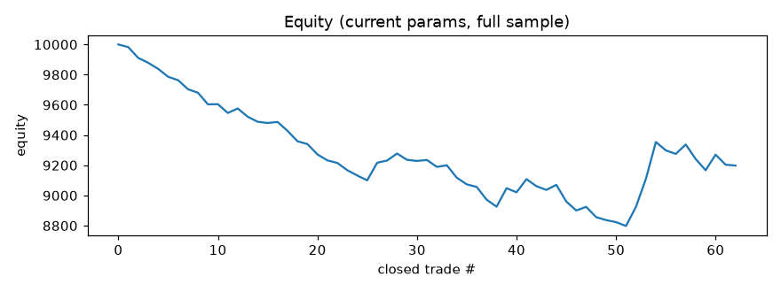

# Finetune report -- BTCUSDT 15m

_Last run (UTC): 2026-06-13 12:41_

## Current params (live)

```json
{
  "er_len": 20,
  "kama_fast": 2,
  "kama_slow": 30,
  "er_thresh": 0.35,
  "use_adx": true,
  "adx_len": 14,
  "adx_thresh": 20.0,
  "don_len": 20,
  "atr_len": 14,
  "atr_mult": 3.5,
  "chand_len": 22,
  "risk_pct": 1.0,
  "allow_short": true
}
```

## Latest cycle

- Current-params net profit (full sample): **-8.06%**, PF 0.603, 62 trades, max DD -1205.63
- Optimizer out-of-sample: net **4.09%**, PF 2.069, 13 trades
- Decision: **kept current params**



## Recent runs

| time (UTC) | data bars | live net% | live PF | OOS net% | OOS PF | accepted |
|---|---|---|---|---|---|---|
| 2026-06-12 00:58 | 5000 | -7.02 | 0.662 | 3.34 | 1.664 | True |
| 2026-06-12 05:38 | 5000 | -7.2 | 0.656 | 4.41 | 2.139 | False |
| 2026-06-12 09:29 | 5000 | -7.45 | 0.647 | 3.37 | 1.669 | True |
| 2026-06-12 13:14 | 5000 | -6.85 | 0.677 | 3.26 | 1.647 | True |
| 2026-06-12 17:03 | 5000 | -6.15 | 0.702 | 3.85 | 1.898 | False |
| 2026-06-12 20:47 | 5000 | -6.06 | 0.707 | 3.85 | 1.898 | False |
| 2026-06-13 00:57 | 5000 | -7.72 | 0.619 | 3.85 | 1.898 | False |
| 2026-06-13 05:35 | 5000 | -8.06 | 0.602 | 4.13 | 2.068 | False |
| 2026-06-13 09:08 | 5000 | -8.08 | 0.601 | 3.86 | 1.899 | False |
| 2026-06-13 12:41 | 5000 | -8.06 | 0.603 | 4.09 | 2.069 | False |
