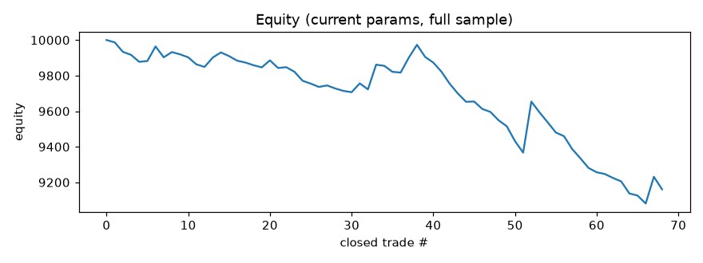

# Finetune report -- BTCUSDT 15m

_Last run (UTC): 2026-08-04 14:07_

## Current params (live)

```json
{
  "er_len": 20,
  "kama_fast": 2,
  "kama_slow": 30,
  "er_thresh": 0.35,
  "use_adx": true,
  "adx_len": 14,
  "adx_thresh": 20.0,
  "don_len": 30,
  "atr_len": 14,
  "atr_mult": 3.5,
  "chand_len": 22,
  "risk_pct": 1.0,
  "allow_short": true
}
```

## Latest cycle

- Current-params net profit (full sample): **-15.57%**, PF 0.412, 78 trades, max DD -1633.28
- Optimizer out-of-sample: net **-5.67%**, PF 0.36, 31 trades
- Decision: **kept current params**



## Recent runs

| time (UTC) | data bars | live net% | live PF | OOS net% | OOS PF | accepted |
|---|---|---|---|---|---|---|
| 2026-08-03 02:41 | 5000 | -16.2 | 0.389 | -7.56 | 0.237 | False |
| 2026-08-03 06:58 | 5000 | -16.23 | 0.389 | -7.41 | 0.242 | False |
| 2026-08-03 11:21 | 5000 | -15.75 | 0.406 | -6.88 | 0.293 | False |
| 2026-08-03 14:35 | 5000 | -15.78 | 0.406 | -6.91 | 0.293 | False |
| 2026-08-03 17:49 | 5000 | -15.79 | 0.405 | -7.01 | 0.29 | False |
| 2026-08-03 21:00 | 5000 | -15.78 | 0.406 | -7.31 | 0.281 | False |
| 2026-08-04 02:25 | 5000 | -15.5 | 0.415 | -6.9 | 0.312 | False |
| 2026-08-04 06:26 | 5000 | -15.9 | 0.406 | -6.81 | 0.316 | False |
| 2026-08-04 10:37 | 5000 | -15.57 | 0.412 | -6.08 | 0.343 | False |
| 2026-08-04 14:07 | 5000 | -15.57 | 0.412 | -5.67 | 0.36 | False |
