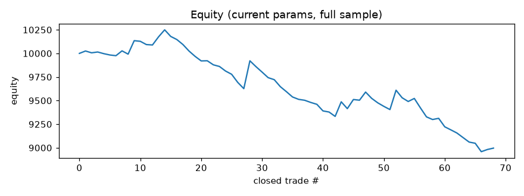

# Finetune report -- BTCUSDT 15m

_Last run (UTC): 2026-10-05 08:24_

## Current params (live)

```json
{
  "er_len": 20,
  "kama_fast": 2,
  "kama_slow": 30,
  "er_thresh": 0.35,
  "use_adx": true,
  "adx_len": 14,
  "adx_thresh": 20.0,
  "don_len": 30,
  "atr_len": 14,
  "atr_mult": 3.5,
  "chand_len": 22,
  "risk_pct": 1.0,
  "allow_short": true
}
```

## Latest cycle

- Current-params net profit (full sample): **-9.83%**, PF 0.574, 68 trades, max DD -1290.62
- Optimizer out-of-sample: net **-5.65%**, PF 0.448, 29 trades
- Decision: **kept current params**



## Recent runs

| time (UTC) | data bars | live net% | live PF | OOS net% | OOS PF | accepted |
|---|---|---|---|---|---|---|
| 2026-10-03 21:01 | 5000 | -10.56 | 0.545 | -4.61 | 0.519 | False |
| 2026-10-04 01:10 | 5000 | -10.56 | 0.545 | -5.56 | 0.414 | False |
| 2026-10-04 05:30 | 5000 | -10.56 | 0.545 | -5.56 | 0.414 | False |
| 2026-10-04 10:09 | 5000 | -10.6 | 0.545 | -5.6 | 0.414 | False |
| 2026-10-04 13:57 | 5000 | -10.41 | 0.551 | -5.36 | 0.435 | False |
| 2026-10-04 17:28 | 5000 | -10.41 | 0.551 | -5.36 | 0.435 | False |
| 2026-10-04 20:47 | 5000 | -10.08 | 0.566 | -5.39 | 0.436 | False |
| 2026-10-05 00:35 | 5000 | -10.07 | 0.566 | -4.61 | 0.499 | False |
| 2026-10-05 04:19 | 5000 | -9.83 | 0.574 | -5.54 | 0.452 | False |
| 2026-10-05 08:24 | 5000 | -9.83 | 0.574 | -5.65 | 0.448 | False |
