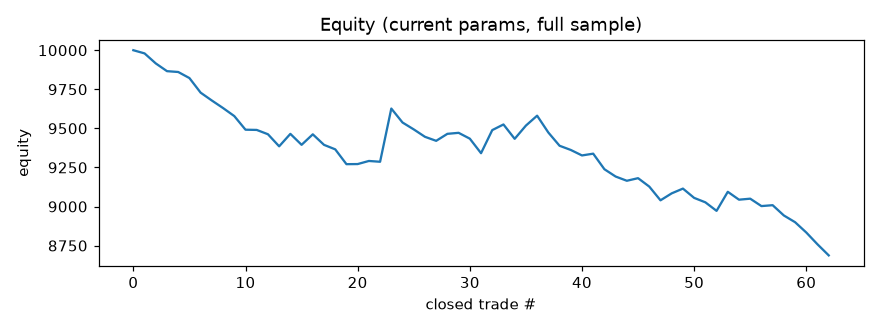

# Finetune report -- ETCUSDT 15m

_Last run (UTC): 2026-07-19 06:29_

## Current params (live)

```json
{
  "er_len": 20,
  "kama_fast": 2,
  "kama_slow": 30,
  "er_thresh": 0.25,
  "use_adx": true,
  "adx_len": 14,
  "adx_thresh": 20.0,
  "don_len": 15,
  "atr_len": 14,
  "atr_mult": 3.5,
  "chand_len": 18,
  "risk_pct": 1.0,
  "allow_short": true
}
```

## Latest cycle

- Current-params net profit (full sample): **-13.13%**, PF 0.462, 62 trades, max DD -1312.71
- Optimizer out-of-sample: net **-5.12%**, PF 0.269, 14 trades
- Decision: **kept current params**



## Recent runs

| time (UTC) | data bars | live net% | live PF | OOS net% | OOS PF | accepted |
|---|---|---|---|---|---|---|
| 2026-07-17 17:10 | 5000 | -12.77 | 0.489 | -4.48 | 0.317 | False |
| 2026-07-17 20:53 | 5000 | -13.45 | 0.475 | -5.84 | 0.26 | False |
| 2026-07-18 02:24 | 5000 | -13.45 | 0.475 | -5.57 | 0.27 | False |
| 2026-07-18 06:04 | 5000 | -13.44 | 0.476 | -5.61 | 0.268 | False |
| 2026-07-18 09:24 | 5000 | -12.98 | 0.486 | -4.95 | 0.295 | False |
| 2026-07-18 13:12 | 5000 | -12.18 | 0.504 | -4.95 | 0.295 | False |
| 2026-07-18 16:57 | 5000 | -11.36 | 0.541 | -4.95 | 0.296 | False |
| 2026-07-18 20:45 | 5000 | -12.15 | 0.505 | -5.96 | 0.239 | False |
| 2026-07-19 02:36 | 5000 | -13.01 | 0.465 | -5.12 | 0.269 | False |
| 2026-07-19 06:29 | 5000 | -13.13 | 0.462 | -5.12 | 0.269 | False |
