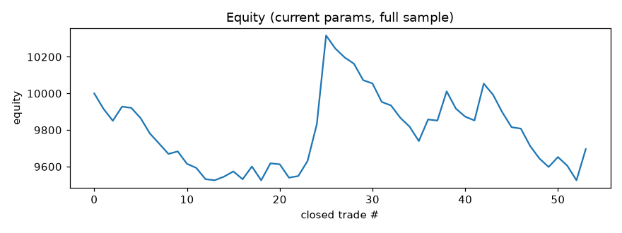

# Finetune report -- ETCUSDT 15m

_Last run (UTC): 2026-08-09 20:09_

## Current params (live)

```json
{
  "er_len": 20,
  "kama_fast": 2,
  "kama_slow": 30,
  "er_thresh": 0.3,
  "use_adx": true,
  "adx_len": 14,
  "adx_thresh": 20.0,
  "don_len": 15,
  "atr_len": 14,
  "atr_mult": 3.5,
  "chand_len": 22,
  "risk_pct": 1.0,
  "allow_short": true
}
```

## Latest cycle

- Current-params net profit (full sample): **-13.97%**, PF 0.448, 60 trades, max DD -1496.55
- Optimizer out-of-sample: net **-2.95%**, PF 0.628, 17 trades
- Decision: **kept current params**



## Recent runs

| time (UTC) | data bars | live net% | live PF | OOS net% | OOS PF | accepted |
|---|---|---|---|---|---|---|
| 2026-08-08 08:14 | 5000 | -15.54 | 0.435 | -0.3 | 0.952 | False |
| 2026-08-08 12:10 | 5000 | -15.56 | 0.435 | -0.17 | 0.973 | False |
| 2026-08-08 16:09 | 5000 | -14.8 | 0.449 | 0.1 | 1.016 | True |
| 2026-08-08 20:08 | 5000 | -14.36 | 0.441 | -0.51 | 0.923 | False |
| 2026-08-09 00:20 | 5000 | -14.38 | 0.44 | -1.77 | 0.728 | False |
| 2026-08-09 04:29 | 5000 | -13.96 | 0.449 | -1.74 | 0.733 | False |
| 2026-08-09 08:15 | 5000 | -13.96 | 0.449 | -1.83 | 0.718 | False |
| 2026-08-09 12:11 | 5000 | -13.96 | 0.449 | -1.83 | 0.719 | False |
| 2026-08-09 16:09 | 5000 | -13.98 | 0.448 | -2.9 | 0.63 | False |
| 2026-08-09 20:09 | 5000 | -13.97 | 0.448 | -2.95 | 0.628 | False |
