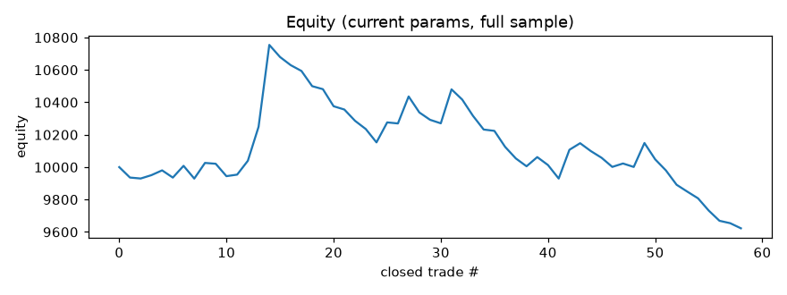

# Finetune report -- ETCUSDT 15m

_Last run (UTC): 2026-10-08 00:33_

## Current params (live)

```json
{
  "er_len": 20,
  "kama_fast": 2,
  "kama_slow": 30,
  "er_thresh": 0.35,
  "use_adx": true,
  "adx_len": 14,
  "adx_thresh": 20.0,
  "don_len": 30,
  "atr_len": 14,
  "atr_mult": 3.5,
  "chand_len": 26,
  "risk_pct": 1.0,
  "allow_short": true
}
```

## Latest cycle

- Current-params net profit (full sample): **-5.76%**, PF 0.768, 59 trades, max DD -1407.44
- Optimizer out-of-sample: net **-6.64%**, PF 0.213, 19 trades
- Decision: **kept current params**



## Recent runs

| time (UTC) | data bars | live net% | live PF | OOS net% | OOS PF | accepted |
|---|---|---|---|---|---|---|
| 2026-10-06 12:18 | 5000 | -5.85 | 0.77 | -6.58 | 0.232 | False |
| 2026-10-06 16:14 | 5000 | -5.85 | 0.77 | -6.57 | 0.232 | False |
| 2026-10-06 20:13 | 5000 | -5.85 | 0.77 | -6.05 | 0.248 | False |
| 2026-10-07 00:34 | 5000 | -5.43 | 0.784 | -6.05 | 0.248 | False |
| 2026-10-07 04:15 | 5000 | -5.79 | 0.772 | -6.42 | 0.238 | False |
| 2026-10-07 08:17 | 5000 | -5.79 | 0.772 | -6.42 | 0.238 | False |
| 2026-10-07 12:19 | 5000 | -5.8 | 0.772 | -6.42 | 0.238 | False |
| 2026-10-07 16:13 | 5000 | -5.74 | 0.768 | -6.42 | 0.237 | False |
| 2026-10-07 20:13 | 5000 | -5.74 | 0.768 | -6.42 | 0.237 | False |
| 2026-10-08 00:33 | 5000 | -5.76 | 0.768 | -6.64 | 0.213 | False |
