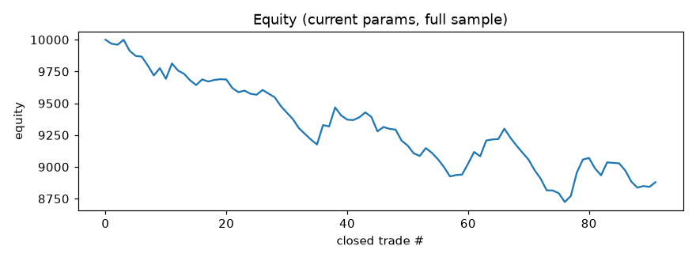

# Finetune report -- ETHUSDT 15m

_Last run (UTC): 2026-06-23 09:13_

## Current params (live)

```json
{
  "er_len": 20,
  "kama_fast": 2,
  "kama_slow": 30,
  "er_thresh": 0.25,
  "use_adx": true,
  "adx_len": 14,
  "adx_thresh": 20.0,
  "don_len": 15,
  "atr_len": 14,
  "atr_mult": 3.5,
  "chand_len": 22,
  "risk_pct": 1.0,
  "allow_short": true
}
```

## Latest cycle

- Current-params net profit (full sample): **-11.22%**, PF 0.602, 91 trades, max DD -1278.74
- Optimizer out-of-sample: net **-3.17%**, PF 0.633, 23 trades
- Decision: **kept current params**



## Recent runs

| time (UTC) | data bars | live net% | live PF | OOS net% | OOS PF | accepted |
|---|---|---|---|---|---|---|
| 2026-06-21 20:35 | 5000 | -11.99 | 0.577 | -4.14 | 0.581 | False |
| 2026-06-22 00:58 | 5000 | -11.67 | 0.585 | -4.15 | 0.581 | False |
| 2026-06-22 05:53 | 5000 | -11.66 | 0.585 | -3.77 | 0.621 | False |
| 2026-06-22 10:05 | 5000 | -12.29 | 0.571 | -3.63 | 0.638 | False |
| 2026-06-22 13:57 | 5000 | -11.87 | 0.581 | -4.94 | 0.5 | False |
| 2026-06-22 17:34 | 5000 | -11.68 | 0.586 | -5.48 | 0.473 | False |
| 2026-06-22 21:04 | 5000 | -11.24 | 0.597 | -4.86 | 0.505 | False |
| 2026-06-23 00:50 | 5000 | -11.52 | 0.59 | -4.85 | 0.505 | False |
| 2026-06-23 05:25 | 5000 | -11.52 | 0.59 | -4.11 | 0.548 | False |
| 2026-06-23 09:13 | 5000 | -11.22 | 0.602 | -3.17 | 0.633 | False |
