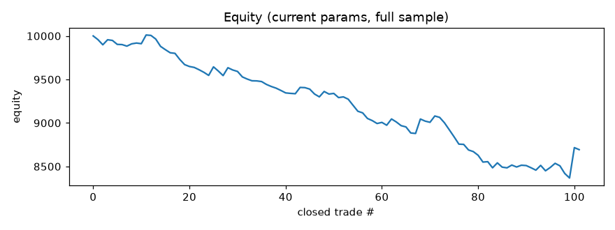

# Finetune report -- ETHUSDT 15m

_Last run (UTC): 2026-08-19 00:13_

## Current params (live)

```json
{
  "er_len": 20,
  "kama_fast": 2,
  "kama_slow": 30,
  "er_thresh": 0.25,
  "use_adx": true,
  "adx_len": 14,
  "adx_thresh": 20.0,
  "don_len": 15,
  "atr_len": 14,
  "atr_mult": 3.5,
  "chand_len": 22,
  "risk_pct": 1.0,
  "allow_short": true
}
```

## Latest cycle

- Current-params net profit (full sample): **-19.96%**, PF 0.344, 101 trades, max DD -2030.16
- Optimizer out-of-sample: net **-6.55%**, PF 0.223, 27 trades
- Decision: **kept current params**



## Recent runs

| time (UTC) | data bars | live net% | live PF | OOS net% | OOS PF | accepted |
|---|---|---|---|---|---|---|
| 2026-08-17 12:08 | 5000 | -20.2 | 0.339 | -4.25 | 0.352 | False |
| 2026-08-17 16:06 | 5000 | -20.23 | 0.339 | -4.26 | 0.352 | False |
| 2026-08-17 20:07 | 5000 | -20.23 | 0.339 | -4.22 | 0.354 | False |
| 2026-08-18 00:14 | 5000 | -19.71 | 0.347 | -5.55 | 0.258 | False |
| 2026-08-18 04:15 | 5000 | -19.66 | 0.351 | -5.57 | 0.258 | False |
| 2026-08-18 08:11 | 5000 | -19.77 | 0.352 | -5.57 | 0.322 | False |
| 2026-08-18 12:09 | 5000 | -19.96 | 0.344 | -5.56 | 0.323 | False |
| 2026-08-18 16:08 | 5000 | -19.96 | 0.344 | -6.22 | 0.237 | False |
| 2026-08-18 20:06 | 5000 | -19.96 | 0.344 | -6.25 | 0.232 | False |
| 2026-08-19 00:13 | 5000 | -19.96 | 0.344 | -6.55 | 0.223 | False |
