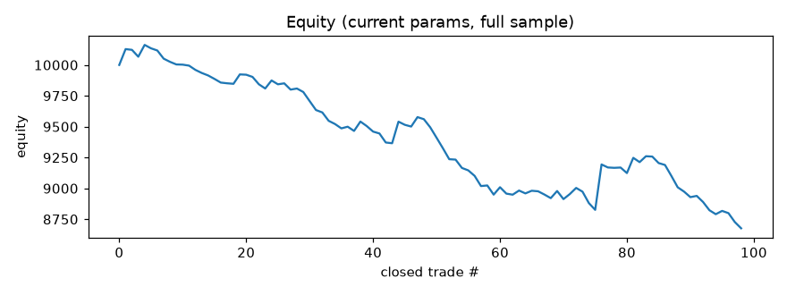

# Finetune report -- ETHUSDT 15m

_Last run (UTC): 2026-09-30 04:14_

## Current params (live)

```json
{
  "er_len": 20,
  "kama_fast": 2,
  "kama_slow": 30,
  "er_thresh": 0.25,
  "use_adx": true,
  "adx_len": 14,
  "adx_thresh": 20.0,
  "don_len": 15,
  "atr_len": 14,
  "atr_mult": 3.5,
  "chand_len": 22,
  "risk_pct": 1.0,
  "allow_short": true
}
```

## Latest cycle

- Current-params net profit (full sample): **-13.54%**, PF 0.525, 97 trades, max DD -1362.18
- Optimizer out-of-sample: net **-0.88%**, PF 0.888, 22 trades
- Decision: **kept current params**



## Recent runs

| time (UTC) | data bars | live net% | live PF | OOS net% | OOS PF | accepted |
|---|---|---|---|---|---|---|
| 2026-09-28 16:14 | 5000 | -13.5 | 0.524 | -5.1 | 0.507 | False |
| 2026-09-28 20:11 | 5000 | -13.5 | 0.524 | -5.67 | 0.479 | False |
| 2026-09-29 00:32 | 5000 | -13.5 | 0.524 | -4.73 | 0.526 | False |
| 2026-09-29 04:14 | 5000 | -13.5 | 0.524 | -4.77 | 0.524 | False |
| 2026-09-29 08:16 | 5000 | -13.53 | 0.524 | -1.04 | 0.879 | False |
| 2026-09-29 12:18 | 5000 | -13.62 | 0.523 | -1.62 | 0.817 | False |
| 2026-09-29 16:13 | 5000 | -13.65 | 0.523 | -2.16 | 0.785 | False |
| 2026-09-29 20:13 | 5000 | -13.83 | 0.519 | -1.95 | 0.803 | False |
| 2026-09-30 00:34 | 5000 | -13.57 | 0.524 | -0.69 | 0.923 | False |
| 2026-09-30 04:14 | 5000 | -13.54 | 0.525 | -0.88 | 0.888 | False |
