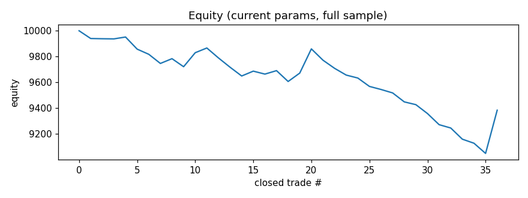

# Finetune report — BTCUSDT 4h

_Last run (UTC): 2026-06-08 09:40_

## Current params (live)

```json
{
  "er_len": 20,
  "kama_fast": 2,
  "kama_slow": 30,
  "er_thresh": 0.3,
  "use_adx": true,
  "adx_len": 14,
  "adx_thresh": 20.0,
  "don_len": 20,
  "atr_len": 14,
  "atr_mult": 3.0,
  "chand_len": 22,
  "risk_pct": 1.0,
  "allow_short": true
}
```

## Latest cycle

- Current-params net profit (full sample): **-6.52%**, PF 0.58, 36 trades, max DD -987.21
- Optimizer out-of-sample: net **-1.53%**, PF 0.716, 10 trades
- Decision: **kept current params**



## Recent runs

| time (UTC) | data bars | live net% | live PF | OOS net% | OOS PF | accepted |
|---|---|---|---|---|---|---|
| 2026-06-06 20:28 | 1500 | -9.33 | 0.366 | -5.34 | 0.006 | False |
| 2026-06-07 00:55 | 1500 | -9.34 | 0.366 | -5.5 | 0.005 | False |
| 2026-06-07 05:35 | 1500 | -9.34 | 0.365 | -5.06 | 0.006 | False |
| 2026-06-07 09:06 | 1500 | -9.88 | 0.351 | -5.06 | 0.006 | False |
| 2026-06-07 12:37 | 1500 | -9.86 | 0.351 | -5.06 | 0.006 | False |
| 2026-06-07 16:33 | 1500 | -9.88 | 0.351 | -5.06 | 0.006 | False |
| 2026-06-07 20:30 | 1500 | -9.89 | 0.35 | -5.06 | 0.006 | False |
| 2026-06-08 00:56 | 1500 | -6.54 | 0.579 | -1.53 | 0.716 | False |
| 2026-06-08 05:39 | 1500 | -6.49 | 0.581 | -1.53 | 0.716 | False |
| 2026-06-08 09:40 | 1500 | -6.52 | 0.58 | -1.53 | 0.716 | False |
